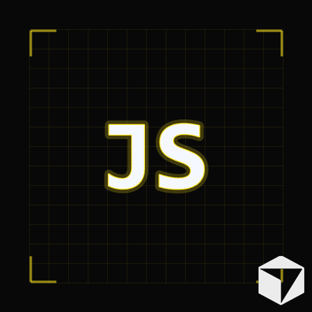

# Discord Coding Presence

A VS Code / Cursor / TaxCode extension that shows your coding activity on Discord.

[](https://marketplace.visualstudio.com/items?itemName=Taxperia.cursor-presence)
[](https://open-vsx.org/extension/Taxperia/cursor-presence)

## Features

- Shows current file name on Discord
- Shows workspace name
- Detects and displays programming language (50+ languages)
- Ten artwork modes including filled text, outline, language logos, Neon Mono, and geometric Tech Cards with optional embedded editor logos
- GitHub-hosted artwork and a cached, remotely refreshed language catalog
- English and Turkish Rich Presence messages
- Privacy mode and customizable Details / State text
- Automatic protection for sensitive file names with customizable wildcard patterns
- Tracks elapsed time
- Configurable idle detection that can show an idle status or clear the activity
- Workspace exclusion patterns for projects that should never be published
- Auto-connect with progressive reconnect delays
- Status bar connection indicator with quick controls for enable, pause, privacy, reconnect, and settings

## Artwork Modes

The extension supports the following large-image settings:

| Setting | Artwork |
|---|---|
| `editor` | Detected editor's icon |
| `languageText` | Filled language text |
| `languageTextEditor` | Filled language text with the editor icon in the corner |
| `languageOutline` | Outlined language text |
| `languageOutlineEditor` | Outlined language text with the editor icon in the corner |
| `languageLogo` | Language logo, falling back to filled text if unavailable |
| `languageMono` | Bright monospace text with a language-colored neon glow and coding grid |
| `languageMonoEditor` | Neon Mono with the detected editor logo embedded in the corner |
| `languageCard` | Supplied transparent technology frame, recolored to match the active language, with large white text |
| `languageCardEditor` | Color-matched Tech Card with the detected editor logo embedded in the lower-right corner |

| Neon Mono | Tech Card |
|---|---|
|  |  |

The optional small editor badge uses Discord's native `small_image` field.
Discord controls its placement and shape. Embedded-icon modes omit that
separate badge. There is no glass-style setting.

## Installation

### Cursor (Recommended)

Open Cursor → Extensions → Search "Cursor Discord Rich Presence" → Install

### VS Code

Open VS Code → Extensions → Search "Cursor Discord Rich Presence" → Install

### TaxCode

Use a plugin-enabled [TaxCode edition](https://github.com/Taxperia/TaxCode#editions).
Open Extensions and search for `Taxperia.cursor-presence` (Discord Coding
Presence), or run **Extensions: Install from VSIX...** from the Command Palette
to install a locally built release. The CLI equivalent is:

```powershell
taxcode --install-extension path/to/cursor-presence.vsix
```

TaxCode is detected automatically using its application name or `taxcode` URI
scheme. All ten artwork modes use its white icon where an editor logo is shown.
No separate extension or Discord application ID is needed. Builds that disable
third-party extensions must allow this extension before it can run.

TaxCode artwork and GitHub-hosted images are available starting with version
1.1.3. Use that version or newer for these features.

### Manual Installation

1. Download the latest `.vsix` from [GitHub Releases](https://github.com/Taxperia/Discord-Rich-Presence/releases)
2. Open Cursor/VS Code
3. Press `Ctrl+Shift+P`
4. Type "Extensions: Install from VSIX..."
5. Select the downloaded `.vsix` file
6. Restart

## Settings

`Ctrl+Shift+P` → "Preferences: Open Settings" → search `cursorDiscord`:

| Setting | Default | Description |
|---------|---------|-------------|
| `enabled` | `true` | Enable or disable Rich Presence |
| `language` | `"auto"` | Use the editor language, English, or Turkish |
| `largeImageMode` | `"languageText"` | Choose the editor logo, text, outline, language logo, Neon Mono, or Tech Card artwork |
| `privacyMode` | `false` | Hide file and workspace names |
| `showSmallEditorIcon` | `true` | Show the detected editor as Discord's small badge in compatible modes |
| `showWorkspace` | `true` | Show workspace name on Discord |
| `showFileName` | `true` | Show current file name on Discord |
| `showLanguage` | `true` | Show programming language on Discord |
| `showElapsedTime` | `true` | Show elapsed time on Discord |
| `idleTimeout` | `300` | Seconds without editor activity before becoming idle; use `0` to disable automatic detection |
| `idleBehavior` | `"idle"` | Show an idle presence or clear the Discord activity while idle |
| `hideSensitiveFiles` | `true` | Automatically hide common secret, credential, environment, and key file names |
| `hiddenFilePatterns` | sensitive defaults | File-name wildcard patterns hidden from Discord |
| `disabledWorkspacePatterns` | `[]` | Workspace name or full-path wildcard patterns where activity is cleared |
| `customDetails` | `""` | Custom Details template |
| `customState` | `""` | Custom State template |
| `idleMessage` | `""` | Custom idle message; empty uses the selected language |

Custom Details and State support `{file}`, `{workspace}`, `{language}`, and
`{app}` variables. Privacy mode replaces file and workspace variables with
private labels.

## Commands

| Command | Description |
|---------|-------------|
| `Discord RPC: Open Settings` | Open all extension settings |
| `Discord RPC: Show Quick Menu` | Open status-bar controls |
| `Discord RPC: Pause Presence` | Temporarily clear activity without disconnecting |
| `Discord RPC: Resume Presence` | Resume activity and reset the idle timer |
| `Discord RPC: Toggle Privacy Mode` | Toggle global privacy mode |
| `Discord RPC: Reconnect` | Reconnect to Discord |
| `Discord RPC: Disconnect` | Disconnect from Discord |

## Supported Languages

JavaScript, TypeScript, Python, Java, C++, C, C#, Go, Rust, Ruby, PHP, Swift, Kotlin, HTML, CSS, SCSS, JSON, Markdown, YAML, XML, SQL, Shell, Bash, PowerShell, Docker, TOML, Vue, Svelte, JSX, TSX, Lua, Dart, R, Elixir, Haskell, Scala, Solidity, Terraform, Zig, Julia, F#, Objective-C, Objective-C++, Perl, Groovy, OCaml, Nim, Fortran, Visual Basic, Crystal, COBOL and more.

## Requirements

- Cursor, VS Code 1.74 or higher, or a compatible plugin-enabled TaxCode edition
- Discord desktop app (running)

## Technical Details

- Uses raw Discord IPC Protocol (no external dependencies)
- Uses local Discord IPC (named pipes on Windows and Unix sockets on macOS/Linux) instead of WebSocket
- Scans Discord IPC channels `0` through `9` and prevents duplicate reconnect attempts
- Uses the active file's owning folder in multi-root workspaces
- Runs in the local UI extension host so Discord IPC stays on the desktop during remote workspace sessions
- Sends ping every 30 seconds to keep connection alive
- Artwork is served from public GitHub URLs; no per-image Developer Portal upload is needed
- The language catalog refreshes in the background every six hours, with cached and bundled fallbacks
- See [artwork folders, adding languages, and deployment order](src/image/rich-presence/README.md)

Run `npm run test:taxcode` on Windows to check activation, commands, editor
detection, and artwork selection in the installed TaxCode extension host.
The test uses an isolated profile with Rich Presence disabled. It does not
verify Discord rendering or install into your normal TaxCode profile. For a
custom installation path, run:

```powershell
powershell -NoProfile -ExecutionPolicy Bypass -File scripts/test-taxcode.ps1 -TaxCodePath "C:\path\to\TaxCode.exe"
```

Extension activation, commands, local UI hosting, TaxCode detection, and
TypeScript artwork selection were verified in TaxCode 1.139.2 on Windows.

## Contributing

1. Fork the repository
2. Create a feature branch
3. Commit your changes
4. Push to the branch
5. Open a Pull Request

## License

[Apache License 2.0](LICENSE)
