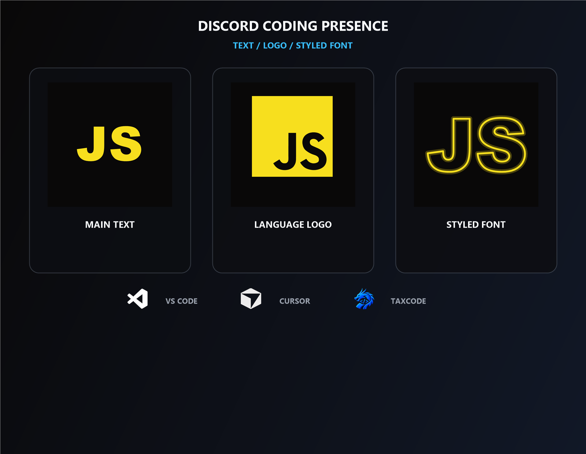
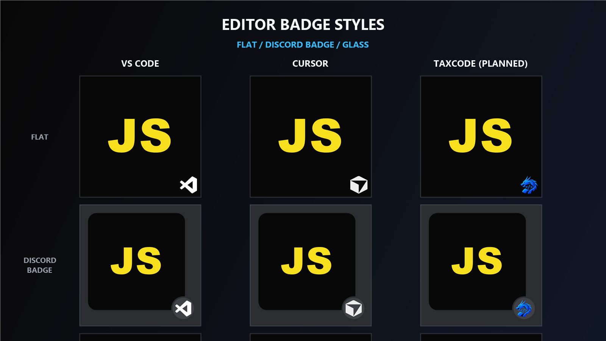
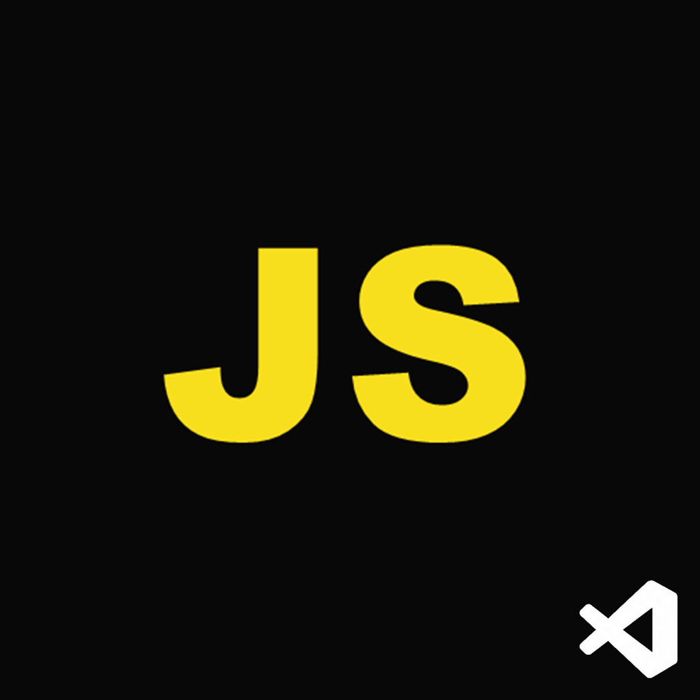
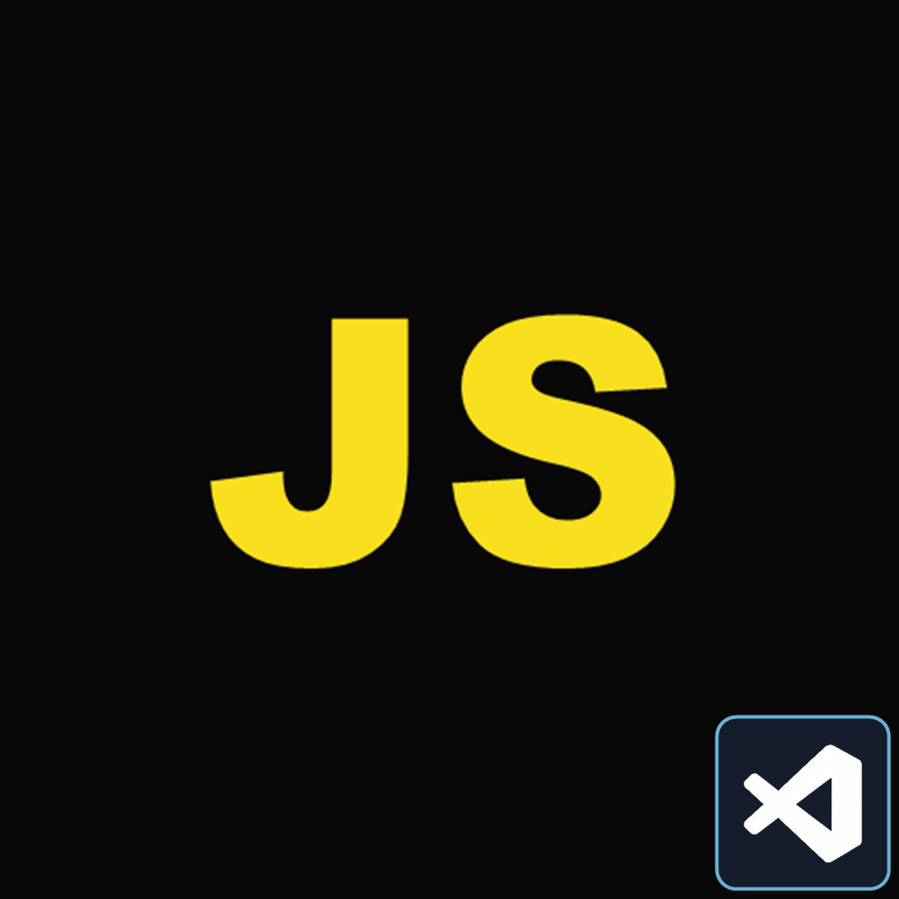
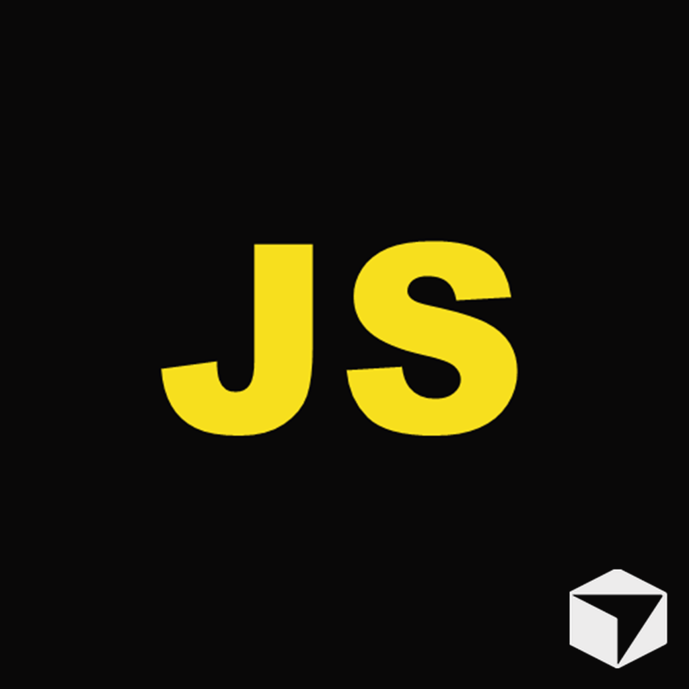
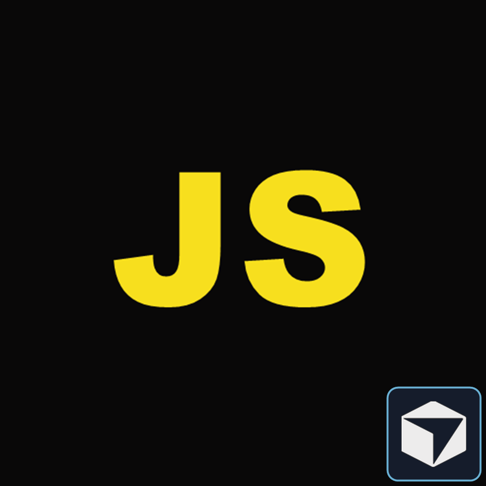
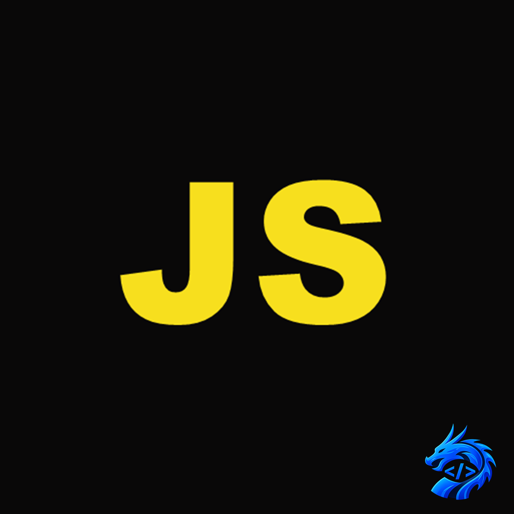
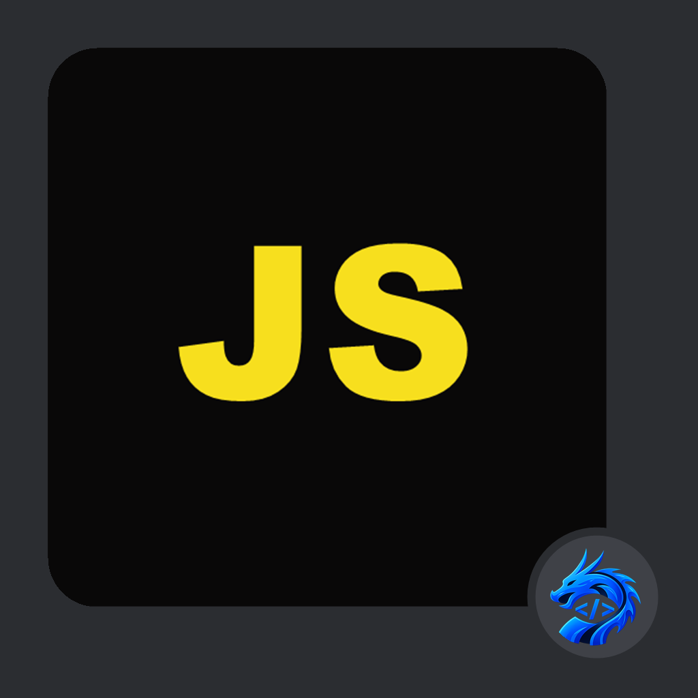
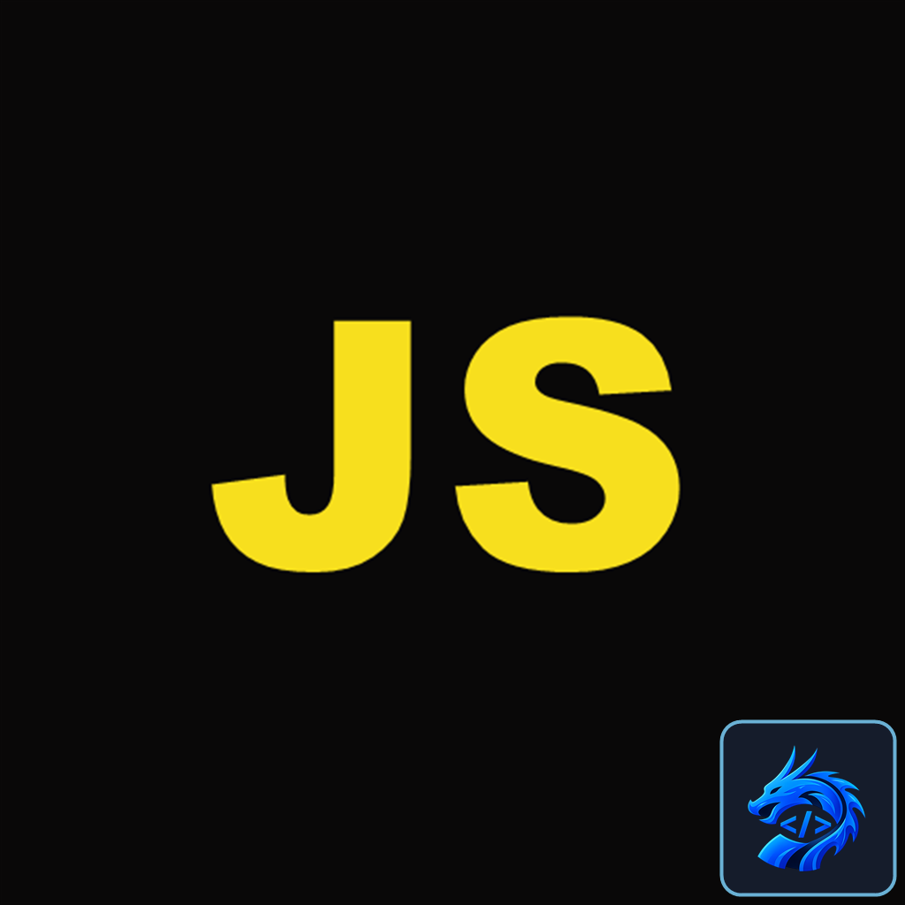

# Discord Coding Presence

A VS Code / Cursor extension that shows your coding activity on Discord.

## Features

- Shows current file name on Discord
- Shows workspace name
- Detects and displays programming language (40+ languages)
- Six artwork modes: editor logo, language text, language text with an embedded editor logo, outlined text, outlined text with an embedded editor logo, or language logo
- English and Turkish Rich Presence messages
- Privacy mode and customizable Details / State text
- Tracks elapsed time
- Idle mode when window loses focus
- Auto-connect and reconnect
- Status bar connection indicator

## Discord Preview

## Artwork Modes

Choose between a clean language abbreviation, the language's original logo,
or a custom outlined font. Editor-aware modes can also place a small editor
badge on the artwork.

## Editor Badge Styles

VS Code and Cursor are supported editors. TaxCode support is planned. The flat
style embeds the editor logo in the large image, the oval style previews
Discord's native circular `small_image` badge, and glass is an alternate
embedded treatment.

Open individual editor badge previews

| Editor | Flat / embedded | Oval / Discord badge | Glass |
|---|---|---|---|
| VS Code |  |  |  |
| Cursor |  |  |  |
| TaxCode (planned) |  |  |  |

## Installation

### Cursor (Recommended)

Open Cursor → Extensions → Search "Cursor Discord Rich Presence" → Install

### VS Code

Open VS Code → Extensions → Search "Cursor Discord Rich Presence" → Install

### Manual Installation

1. Download the latest `.vsix` from [GitHub Releases](https://github.com/Taxperia/cursor-discord-presence/releases)
2. Open Cursor/VS Code
3. Press `Ctrl+Shift+P`
4. Type "Extensions: Install from VSIX..."
5. Select the downloaded `.vsix` file
6. Restart

## Settings

`Ctrl+Shift+P` → "Preferences: Open Settings" → search `cursorDiscord`:

| Setting | Default | Description |
|---------|---------|-------------|
| `enabled` | `true` | Enable or disable Rich Presence |
| `language` | `"auto"` | Use the editor language, English, or Turkish |
| `largeImageMode` | `"languageText"` | Choose the editor logo, language text, filled or outlined text with an embedded editor logo, or language logo |
| `privacyMode` | `false` | Hide file and workspace names |
| `showSmallEditorIcon` | `true` | Show Cursor / VS Code as Discord's small badge in compatible modes |
| `showWorkspace` | `true` | Show workspace name on Discord |
| `showFileName` | `true` | Show current file name on Discord |
| `showLanguage` | `true` | Show programming language on Discord |
| `showElapsedTime` | `true` | Show elapsed time on Discord |
| `customDetails` | `""` | Custom Details template |
| `customState` | `""` | Custom State template |
| `idleMessage` | `""` | Custom idle message; empty uses the selected language |

Custom Details and State support `{file}`, `{workspace}`, `{language}`, and
`{app}` variables. Privacy mode replaces file and workspace variables with
private labels.

## Commands

| Command | Description |
|---------|-------------|
| `Discord RPC: Open Settings` | Open all extension settings |
| `Discord RPC: Reconnect` | Reconnect to Discord |
| `Discord RPC: Disconnect` | Disconnect from Discord |

## Supported Languages

JavaScript, TypeScript, Python, Java, C++, C, C#, Go, Rust, Ruby, PHP, Swift, Kotlin, HTML, CSS, SCSS, JSON, Markdown, YAML, XML, SQL, Shell, Bash, PowerShell, Docker, TOML, Vue, Svelte, JSX, TSX, Lua, Dart, R, Elixir, Haskell, Scala, Solidity, Terraform and more.

## Requirements

- Cursor or VS Code 1.74 or higher
- Discord desktop app (running)

## Technical Details

- Uses raw Discord IPC Protocol (no external dependencies)
- Uses Named Pipe connection instead of WebSocket (more reliable)
- Sends ping every 30 seconds to keep connection alive
- Runtime bundle size: ~10KB

## Contributing

1. Fork the repository
2. Create a feature branch
3. Commit your changes
4. Push to the branch
5. Open a Pull Request

## License

[Apache License 2.0](LICENSE)
